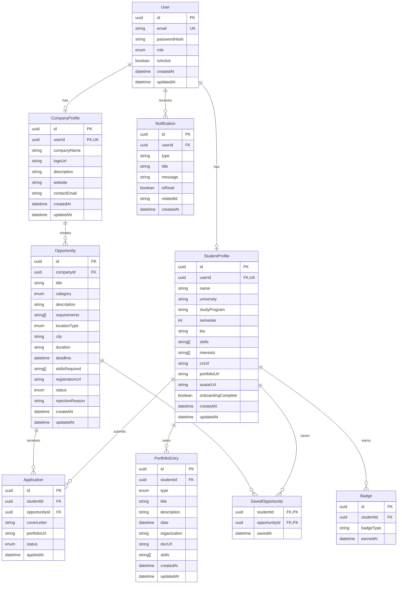

# Software Requirements Specification (SRS)
## IRON LUNG — Intelligent Resource Organizer for Networking, Learning, Unified iNternships, and Group collaboration

---

| Atribut            | Nilai                                                     |
|--------------------|-----------------------------------------------------------|
| **Dokumen ID**     | SRS-IRONLUNG-001                                          |
| **Versi**          | 1.0.0                                                     |
| **Tanggal**        | 5 Juni 2026                                               |
| **Status**         | Draft                                                     |
| **Standar**        | IEEE Std 830-1998 · ISO/IEC 12207 · ISO/IEC 25010         |
| **Proyek**         | Workshop Rekayasa Perangkat Lunak — Semester 4            |
| **Repository**     | `naa2412/iron-lung`                                       |

---

## Daftar Isi

1. [Pendahuluan](#1-pendahuluan)
2. [Deskripsi Umum](#2-deskripsi-umum)
3. [Kebutuhan Fungsional](#3-kebutuhan-fungsional)
4. [Kebutuhan Non-Fungsional](#4-kebutuhan-non-fungsional)
5. [Constraint Sistem](#5-constraint-sistem)
6. [Model Data & Struktur Entitas](#6-model-data--struktur-entitas)
7. [Antarmuka Eksternal](#7-antarmuka-eksternal)
8. [Lampiran](#8-lampiran)

---

## 1. Pendahuluan

### 1.1 Tujuan

Dokumen ini menetapkan kebutuhan perangkat lunak sistem **IRON LUNG** secara lengkap dan terukur sebagai acuan resmi bagi tim pengembang, pemangku kepentingan, dan evaluator kualitas. SRS ini disusun berdasarkan standar IEEE 830-1998 serta memperhatikan prinsip-prinsip ISO/IEC 12207 (siklus hidup perangkat lunak) dan ISO/IEC 25010 (model kualitas produk).

### 1.2 Lingkup Produk

**IRON LUNG** (*Intelligent Resource Organizer for Networking, Learning, Unified iNternships, and Group collaboration*) adalah platform web terpusat yang menjembatani mahasiswa Informatika Indonesia dengan dunia profesional. Platform ini memfasilitasi:

- Pencarian dan lamaran **kesempatan magang** (internship)
- Partisipasi dalam **proyek kolaborasi** lintas institusi
- Pendaftaran **kompetisi teknologi**
- Akses ke **program pelatihan industri**

Sistem dibangun sebagai aplikasi web full-stack dengan arsitektur client-server yang terpisah (decoupled), dapat diakses melalui browser modern, dan di-deploy menggunakan layanan cloud (Vercel untuk frontend, Railway untuk backend).

### 1.3 Definisi, Akronim, dan Singkatan

| Istilah            | Definisi                                                                    |
|--------------------|-----------------------------------------------------------------------------|
| **SRS**            | Software Requirements Specification                                          |
| **IRON LUNG**      | Nama sistem — Intelligent Resource Organizer for Networking, Learning, Unified iNternships, and Group collaboration |
| **Mahasiswa**      | Pengguna bertipe pelajar/pencari peluang (role: `MAHASISWA`)                 |
| **Industri**       | Pengguna bertipe perusahaan/penyedia peluang (role: `INDUSTRI`)              |
| **Admin**          | Pengelola platform dengan hak akses penuh (role: `ADMIN`)                   |
| **Peluang**        | Opportunity — entitas yang mewakili lowongan magang, proyek, kompetisi, atau pelatihan |
| **Lamaran**        | Application — pengajuan Mahasiswa terhadap suatu Peluang                     |
| **Portofolio**     | Kumpulan rekam jejak pengalaman Mahasiswa (magang, proyek, sertifikasi, dll.) |
| **Lencana/Badge**  | Pencapaian digital yang diberikan kepada Mahasiswa berdasarkan aktivitas     |
| **JWT**            | JSON Web Token — mekanisme autentikasi stateless                             |
| **ORM**            | Object-Relational Mapping — Prisma digunakan dalam proyek ini                |
| **API**            | Application Programming Interface                                            |
| **CORS**           | Cross-Origin Resource Sharing                                                |
| **CDN**            | Content Delivery Network                                                     |

### 1.4 Referensi

| No. | Dokumen / Standar                                        |
|-----|----------------------------------------------------------|
| [1] | IEEE Std 830-1998 — Recommended Practice for SRS        |
| [2] | ISO/IEC 12207:2017 — Systems and software engineering — Software life cycle processes |
| [3] | ISO/IEC 25010:2011 — Systems and software quality models |
| [4] | OWASP Top 10:2021 — Application Security Risks          |
| [5] | `README.md` repositori `naa2412/iron-lung`              |
| [6] | `server/prisma/schema.prisma` — skema basis data        |

### 1.5 Gambaran Keseluruhan Dokumen

Dokumen ini terstruktur sebagai berikut:
- **Bagian 2** mendeskripsikan konteks, pengguna, asumsi, dan dependensi sistem secara umum.
- **Bagian 3** merinci setiap kebutuhan fungsional yang dikelompokkan per aktor.
- **Bagian 4** menetapkan kebutuhan non-fungsional (performa, keamanan, keandalan, dll.).
- **Bagian 5** mendokumentasikan constraint teknis dan batasan sistem.
- **Bagian 6** mempresentasikan model data dan relasi entitas.
- **Bagian 7** mendefinisikan antarmuka eksternal (UI, API, perangkat keras, software).

---

## 2. Deskripsi Umum

### 2.1 Perspektif Produk

IRON LUNG adalah sistem mandiri yang tidak merupakan bagian dari sistem yang sudah ada, melainkan sebuah platform baru. Sistem berinteraksi dengan layanan eksternal sebagai berikut:

```
┌─────────────────────────────────────────────────────────┐
│                    IRON LUNG System                      │
│                                                          │
│  ┌──────────────┐        ┌──────────────────────────┐   │
│  │   Frontend   │◄──────►│       Backend API        │   │
│  │ React + Vite │  HTTPS │  Node.js + Express.js    │   │
│  │  (Vercel)    │        │      (Railway)            │   │
│  └──────────────┘        └────────────┬─────────────┘   │
│                                       │                  │
│                           ┌───────────▼───────────┐     │
│                           │    PostgreSQL DB       │     │
│                           │   (Railway Plugin)    │     │
│                           └───────────────────────┘     │
└─────────────────────────────────────────────────────────┘
         │                          │
         ▼                          ▼
   Cloudinary CDN          JWT Token Service
   (File Storage)         (Stateless Auth)
```

**Deployment:**
- **Frontend:** Vercel (build: `npm run build`, output: `dist/`)
- **Backend:** Railway (auto-migrate on deploy)
- **Database:** PostgreSQL ≥ 14 via Railway Plugin
- **Penyimpanan File:** Cloudinary (gambar profil, CV, dokumen portofolio)

### 2.2 Fungsi-Fungsi Produk

Berikut adalah rangkuman fungsi utama sistem:

| No. | Fungsi Utama              | Aktor        |
|-----|---------------------------|--------------|
| F01 | Registrasi & Autentikasi  | Semua        |
| F02 | Manajemen Profil          | Mahasiswa, Industri |
| F03 | Pencarian & Filter Peluang| Mahasiswa, Publik |
| F04 | Pengajuan Lamaran         | Mahasiswa    |
| F05 | Simpan Peluang            | Mahasiswa    |
| F06 | Manajemen Portofolio      | Mahasiswa    |
| F07 | Sistem Lencana/Badge      | Mahasiswa    |
| F08 | Posting Peluang           | Industri     |
| F09 | Manajemen Listing         | Industri     |
| F10 | Manajemen Pelamar         | Industri     |
| F11 | Pencarian Kandidat        | Industri     |
| F12 | Moderasi Konten           | Admin        |
| F13 | Manajemen Pengguna        | Admin        |
| F14 | Analitik Platform         | Admin        |
| F15 | Sistem Notifikasi         | Semua        |

### 2.3 Karakteristik Pengguna

#### 2.3.1 Mahasiswa (`MAHASISWA`)

| Atribut          | Deskripsi                                                      |
|------------------|----------------------------------------------------------------|
| **Peran**        | Pencari peluang magang, kolaborasi, kompetisi, dan pelatihan   |
| **Tingkat Teknis** | Mahasiswa ilmu komputer/informatika, familiar dengan web browser |
| **Motivasi**     | Mengembangkan karier, mendapatkan pengalaman kerja, membangun portofolio |
| **Kebutuhan Khusus** | Onboarding terpandu untuk pengisian profil pertama kali   |

#### 2.3.2 Industri (`INDUSTRI`)

| Atribut          | Deskripsi                                                      |
|------------------|----------------------------------------------------------------|
| **Peran**        | Penyedia peluang — perusahaan atau organisasi rekruter         |
| **Tingkat Teknis** | Profesional HRD/rekruter, tidak harus berlatar teknis        |
| **Motivasi**     | Merekrut talenta mahasiswa berbakat, mempromosikan program perusahaan |
| **Kebutuhan Khusus** | Antarmuka yang sederhana untuk membuat dan mengelola listing |

#### 2.3.3 Admin

| Atribut          | Deskripsi                                                      |
|------------------|----------------------------------------------------------------|
| **Peran**        | Pengelola dan pengawas platform                               |
| **Tingkat Teknis** | Operator platform dengan pemahaman sistem moderat            |
| **Motivasi**     | Memastikan kualitas konten, keamanan platform, dan statistik pengguna |
| **Kebutuhan Khusus** | Dasbor analitik dan kontrol moderasi yang komprehensif    |

#### 2.3.4 Pengunjung Publik (Unauthenticated)

Dapat melihat daftar dan detail peluang yang statusnya `ACTIVE`, namun tidak dapat berinteraksi (melamar, menyimpan, dll.).

### 2.4 Asumsi dan Ketergantungan

#### Asumsi
1. Pengguna memiliki akses ke browser modern (Chrome 90+, Firefox 88+, Edge 90+, Safari 14+).
2. Koneksi internet tersedia pada perangkat pengguna.
3. Mahasiswa mendaftarkan diri menggunakan email institusi atau email pribadi yang valid.
4. Perusahaan mendaftarkan diri menggunakan email korporat yang dapat diverifikasi.
5. Semua dokumen upload (CV, portofolio) berformat file yang didukung Cloudinary.

#### Ketergantungan Eksternal
| Layanan           | Peran                                | Risiko Kegagalan       |
|-------------------|--------------------------------------|------------------------|
| Cloudinary        | Penyimpanan file (avatar, CV, dokumen) | File tidak dapat diupload |
| Railway           | Hosting backend + PostgreSQL         | Sistem offline         |
| Vercel            | Hosting frontend                     | UI tidak dapat diakses |
| npm Registry      | Manajemen dependensi                 | Proses build gagal     |

---

## 3. Kebutuhan Fungsional

> Setiap kebutuhan menggunakan format: **[ID] Deskripsi** — ditandai dengan prioritas **(M)** = Mandatory / **(O)** = Optional.

---

### 3.1 Modul Autentikasi & Otorisasi (AUTH)

#### AUTH-01 — Registrasi Mahasiswa (M)
**Deskripsi:** Sistem harus memungkinkan calon Mahasiswa mendaftarkan akun baru dengan mengisi data: `email`, `password`, `nama`, `universitas`, `program studi`, dan `semester`.

**Kriteria Penerimaan:**
- Email harus unik di seluruh sistem; jika duplikat, kembalikan HTTP 409.
- Password di-hash menggunakan algoritma bcrypt sebelum disimpan.
- Sistem membuat entitas `User` (role: `MAHASISWA`) dan `StudentProfile` secara atomik.
- Input divalidasi menggunakan skema Zod (`registerMahasiswaSchema`).
- Rate limiting diterapkan (endpoint tunduk pada `authLimiter`).

---

#### AUTH-02 — Registrasi Industri (M)
**Deskripsi:** Sistem harus memungkinkan calon perusahaan mendaftarkan akun baru dengan mengisi data: `email`, `password`, dan `companyName`.

**Kriteria Penerimaan:**
- Email harus unik; duplikat dikembalikan sebagai HTTP 409.
- Sistem membuat entitas `User` (role: `INDUSTRI`) dan `CompanyProfile` secara atomik.
- Input divalidasi dengan `registerIndustriSchema`.

---

#### AUTH-03 — Login (M)
**Deskripsi:** Sistem harus mengautentikasi pengguna terdaftar menggunakan kredensial email dan password, kemudian mengembalikan sepasang token JWT.

**Kriteria Penerimaan:**
- Kembalikan `accessToken` (masa aktif pendek) dan `refreshToken` (masa aktif panjang).
- Jika akun dinonaktifkan (`isActive: false`), kembalikan HTTP 403.
- Jika kredensial salah, kembalikan HTTP 401 tanpa mengungkap informasi mana yang salah.
- Rate limiting diterapkan via `authLimiter`.

---

#### AUTH-04 — Refresh Token (M)
**Deskripsi:** Sistem harus menerbitkan `accessToken` baru berdasarkan `refreshToken` yang valid tanpa mengharuskan pengguna login ulang.

**Kriteria Penerimaan:**
- Jika `refreshToken` kedaluwarsa atau tidak valid, kembalikan HTTP 401.
- `accessToken` baru diterbitkan dengan klaim yang identik dengan sesi sebelumnya.

---

#### AUTH-05 — Lupa Password (M)
**Deskripsi:** Sistem harus menyediakan mekanisme reset password melalui verifikasi email.

**Kriteria Penerimaan:**
- Endpoint `POST /api/auth/forgot-password` menerima `email` dan memproses permintaan reset.
- Endpoint `POST /api/auth/reset-password` menerima token reset dan `newPassword`.
- Sistem merespons dengan status sukses meskipun email tidak ditemukan (mencegah user enumeration).

---

#### AUTH-06 — Otorisasi Berbasis Peran (M)
**Deskripsi:** Sistem harus memastikan setiap endpoint yang memerlukan autentikasi hanya dapat diakses oleh peran yang sesuai.

**Kriteria Penerimaan:**
- Middleware `authMiddleware` memverifikasi JWT pada setiap request terproteksi.
- Middleware `roleMiddleware(role)` memblokir akses jika peran pengguna tidak cocok, mengembalikan HTTP 403.
- Tiga peran yang didukung: `MAHASISWA`, `INDUSTRI`, `ADMIN`.

---

### 3.2 Modul Profil Pengguna (USER)

#### USER-01 — Onboarding Mahasiswa (M)
**Deskripsi:** Setelah registrasi, Mahasiswa yang belum melengkapi profil (`onboardingComplete: false`) harus diarahkan ke halaman onboarding untuk mengisi data profil awal.

**Kriteria Penerimaan:**
- Halaman `/onboarding` hanya dapat diakses oleh pengguna terautentikasi.
- Setelah onboarding selesai, field `onboardingComplete` diset menjadi `true`.
- Pengguna dialihkan ke dasbor setelah onboarding berhasil.

---

#### USER-02 — Kelola Profil Mahasiswa (M)
**Deskripsi:** Mahasiswa dapat melihat dan memperbarui data profil: `name`, `university`, `studyProgram`, `semester`, `bio`, `skills`, `interests`, `avatarUrl`, `cvUrl`, `portfolioUrl`.

**Kriteria Penerimaan:**
- Upload avatar dan CV tersimpan di Cloudinary; URL yang dikembalikan disimpan di database.
- Hanya pemilik profil yang dapat memperbarui datanya sendiri.

---

#### USER-03 — Kelola Profil Perusahaan (M)
**Deskripsi:** Pengguna Industri dapat melihat dan memperbarui profil perusahaan: `companyName`, `logoUrl`, `description`, `website`, `contactEmail`.

**Kriteria Penerimaan:**
- Upload logo tersimpan di Cloudinary.
- Hanya akun pemilik profil yang dapat memperbarui profilnya.

---

#### USER-04 — Profil Publik Mahasiswa (O)
**Deskripsi:** Setiap profil Mahasiswa dapat diakses secara publik melalui URL `/profil/:profileId`.

**Kriteria Penerimaan:**
- Informasi yang ditampilkan: nama, universitas, program studi, semester, bio, skills, interests, portofolio.
- Informasi sensitif (email, password hash) tidak diekspos.

---

### 3.3 Modul Peluang (OPPORTUNITY)

#### OPP-01 — Posting Peluang (M)
**Deskripsi:** Pengguna Industri dapat membuat listing peluang baru dengan mengisi detail: `title`, `category`, `description`, `requirements`, `locationType`, `city`, `duration`, `deadline`, `skillsRequired`, `registrationUrl`.

**Kriteria Penerimaan:**
- Kategori yang didukung: `INTERNSHIP`, `COLLABORATION`, `COMPETITION`, `TRAINING`.
- Tipe lokasi yang didukung: `REMOTE`, `ONSITE`, `HYBRID`.
- Peluang yang baru dibuat berstatus `PENDING` hingga disetujui Admin.
- Input divalidasi dengan `createOpportunitySchema`.

---

#### OPP-02 — Daftar & Filter Peluang (M)
**Deskripsi:** Semua pengguna (termasuk publik) dapat melihat daftar peluang yang berstatus `ACTIVE` dengan kemampuan filter dan pencarian.

**Kriteria Penerimaan:**
- Tersedia filter berdasarkan: `category`, `locationType`, `skills`, kata kunci pencarian.
- Hasil yang dikembalikan hanya peluang berstatus `ACTIVE`.
- Pengguna terautentikasi mendapatkan informasi tambahan (misalnya: apakah sudah disimpan).

---

#### OPP-03 — Detail Peluang (M)
**Deskripsi:** Pengguna dapat melihat detail lengkap sebuah peluang termasuk informasi perusahaan.

**Kriteria Penerimaan:**
- Endpoint `GET /api/opportunities/:id` mengembalikan data peluang beserta profil perusahaan.
- Jika pengguna adalah Mahasiswa yang terautentikasi, respons mencakup skor kecocokan berdasarkan skills.

---

#### OPP-04 — Peluang Terpopuler/Trending (M)
**Deskripsi:** Sistem menyediakan daftar peluang populer berdasarkan metrik tertentu (jumlah simpanan, lamaran, dll.).

**Kriteria Penerimaan:**
- Endpoint `GET /api/opportunities/trending` dapat diakses publik.
- Mengembalikan maksimal N peluang berdasarkan popularitas.

---

#### OPP-05 — Rekomendasi Peluang (O)
**Deskripsi:** Sistem memberikan rekomendasi peluang yang dipersonalisasi kepada Mahasiswa berdasarkan skills dan interests mereka.

**Kriteria Penerimaan:**
- Endpoint `GET /api/opportunities/recommended` hanya untuk role `MAHASISWA`.
- Algoritma mencocokkan `skillsRequired` peluang dengan `skills` Mahasiswa.

---

#### OPP-06 — Kelola Listing Perusahaan (M)
**Deskripsi:** Pengguna Industri dapat melihat, memperbarui, dan menghapus peluang yang telah mereka buat.

**Kriteria Penerimaan:**
- `GET /api/opportunities/company` mengembalikan semua listing milik perusahaan yang sedang login.
- `PUT /api/opportunities/:id` hanya dapat dilakukan oleh pemilik listing.
- `DELETE /api/opportunities/:id` hanya dapat dilakukan oleh pemilik listing; semua lamaran terkait dihapus secara cascade.

---

### 3.4 Modul Lamaran (APPLICATION)

#### APP-01 — Ajukan Lamaran (M)
**Deskripsi:** Mahasiswa dapat melamar peluang yang berstatus `ACTIVE` dengan melampirkan cover letter opsional dan URL portofolio.

**Kriteria Penerimaan:**
- Satu Mahasiswa hanya dapat melamar satu peluang satu kali (unique constraint pada `[studentId, opportunityId]`); percobaan duplikat mengembalikan HTTP 409.
- Status lamaran awal adalah `APPLIED`.
- Notifikasi dikirim kepada perusahaan terkait.

---

#### APP-02 — Riwayat Lamaran Mahasiswa (M)
**Deskripsi:** Mahasiswa dapat melihat seluruh lamaran yang pernah diajukan beserta status terkini.

**Kriteria Penerimaan:**
- `GET /api/applications/my` mengembalikan semua lamaran milik Mahasiswa yang sedang login.
- Data termasuk informasi peluang dan status lamaran (`APPLIED`, `VIEWED`, `ACCEPTED`, `REJECTED`).

---

#### APP-03 — Daftar Pelamar (M)
**Deskripsi:** Pengguna Industri dapat melihat semua Mahasiswa yang melamar peluang yang mereka miliki.

**Kriteria Penerimaan:**
- `GET /api/applications/opportunity/:opportunityId` hanya dapat diakses oleh pemilik peluang.
- Data pelamar mencakup profil Mahasiswa dan status lamaran.

---

#### APP-04 — Perbarui Status Lamaran (M)
**Deskripsi:** Pengguna Industri dapat memperbarui status lamaran Mahasiswa menjadi `VIEWED`, `ACCEPTED`, atau `REJECTED`.

**Kriteria Penerimaan:**
- `PUT /api/applications/:id/status` hanya dapat dilakukan oleh pemilik peluang terkait.
- Perubahan status ke `ACCEPTED` atau `REJECTED` memicu notifikasi kepada Mahasiswa.

---

#### APP-05 — Tracking Klik (O)
**Deskripsi:** Sistem merekam interaksi Mahasiswa pada tombol registrasi eksternal peluang.

**Kriteria Penerimaan:**
- `POST /api/applications/track-click/:id` mencatat klik untuk keperluan analitik.

---

### 3.5 Modul Simpan Peluang (SAVED)

#### SAVED-01 — Simpan Peluang (M)
**Deskripsi:** Mahasiswa dapat menyimpan peluang ke daftar favorit untuk ditinjau kembali.

**Kriteria Penerimaan:**
- `POST /api/saved/:opportunityId` menambahkan peluang ke daftar simpanan.
- Duplikat simpanan mengembalikan HTTP 409.
- Jika total simpanan mencapai 5, Mahasiswa otomatis mendapatkan lencana `KOLEKTOR`.

---

#### SAVED-02 — Hapus Simpanan (M)
**Deskripsi:** Mahasiswa dapat menghapus peluang dari daftar simpanan.

**Kriteria Penerimaan:**
- `DELETE /api/saved/:opportunityId` menghapus entri simpanan.
- Pengguna tidak kehilangan lencana `KOLEKTOR` jika sudah pernah mendapatkannya.

---

#### SAVED-03 — Daftar Simpanan (M)
**Deskripsi:** Mahasiswa dapat melihat semua peluang yang telah disimpan.

**Kriteria Penerimaan:**
- `GET /api/saved` mengembalikan daftar peluang tersimpan beserta informasi perusahaan, diurutkan dari yang terbaru disimpan.

---

### 3.6 Modul Portofolio (PORTFOLIO)

#### PORT-01 — Tambah Entri Portofolio (M)
**Deskripsi:** Mahasiswa dapat menambahkan catatan pengalaman ke portofolio digital mereka.

**Kriteria Penerimaan:**
- Field yang tersedia: `type` (INTERNSHIP/PROJECT/COMPETITION/CERTIFICATION/TRAINING), `title`, `description`, `date`, `organization`, `docUrl`, `skills`.
- Input divalidasi dengan `createPortfolioSchema`.
- Upload dokumen (jika ada) diarahkan ke Cloudinary melalui endpoint utils.

---

#### PORT-02 — Lihat Portofolio (M)
**Deskripsi:** Mahasiswa dapat melihat seluruh entri portofolio milik mereka.

**Kriteria Penerimaan:**
- `GET /api/portfolio` mengembalikan semua entri portofolio milik Mahasiswa yang sedang login.

---

#### PORT-03 — Edit Entri Portofolio (M)
**Deskripsi:** Mahasiswa dapat memperbarui data entri portofolio yang sudah ada.

**Kriteria Penerimaan:**
- `PUT /api/portfolio/:id` hanya dapat dilakukan oleh pemilik entri.

---

#### PORT-04 — Hapus Entri Portofolio (M)
**Deskripsi:** Mahasiswa dapat menghapus entri portofolio.

**Kriteria Penerimaan:**
- `DELETE /api/portfolio/:id` hanya dapat dilakukan oleh pemilik entri.

---

### 3.7 Modul Pencarian Kandidat (CANDIDATE)

#### CAND-01 — Cari Kandidat Mahasiswa (M)
**Deskripsi:** Pengguna Industri dapat mencari Mahasiswa berdasarkan kriteria tertentu untuk keperluan rekrutmen proaktif.

**Kriteria Penerimaan:**
- `GET /api/candidates` hanya dapat diakses oleh role `INDUSTRI`.
- Filter yang tersedia: `skills`, `interests`, `university`, `semester`, `search` (nama/universitas).
- Maksimum 50 hasil dikembalikan per request.
- Data kandidat yang diekspos: `name`, `university`, `studyProgram`, `semester`, `bio`, `skills`, `interests`, `avatarUrl`, `portfolioUrl`, jumlah portofolio; **tidak termasuk email dan data sensitif lainnya**.

---

### 3.8 Modul Notifikasi (NOTIFICATION)

#### NOTIF-01 — Terima Notifikasi (M)
**Deskripsi:** Pengguna menerima notifikasi dalam aplikasi untuk event-event penting.

**Kriteria Penerimaan:**
- Event yang memicu notifikasi: peluang disetujui/ditolak, lamaran diterima/ditolak/dilihat, lamaran baru masuk.
- Setiap notifikasi memiliki field: `type`, `title`, `message`, `isRead`, `relatedId`.

---

#### NOTIF-02 — Tandai Notifikasi Sudah Dibaca (M)
**Deskripsi:** Pengguna dapat menandai notifikasi sebagai sudah dibaca.

**Kriteria Penerimaan:**
- Endpoint tersedia untuk menandai satu atau semua notifikasi sebagai dibaca.
- Hanya notifikasi milik pengguna yang sedang login yang dapat diubah statusnya.

---

### 3.9 Modul Admin

#### ADMIN-01 — Statistik Platform (M)
**Deskripsi:** Admin dapat melihat ringkasan statistik platform.

**Kriteria Penerimaan:**
- `GET /api/admin/stats` mengembalikan: total pengguna, total peluang, total lamaran, dan metrik lainnya.
- Hanya dapat diakses oleh role `ADMIN`.

---

#### ADMIN-02 — Moderasi Peluang (M)
**Deskripsi:** Admin dapat meninjau, menyetujui, atau menolak peluang yang berstatus `PENDING`.

**Kriteria Penerimaan:**
- `GET /api/admin/opportunities/pending` mengembalikan semua peluang `PENDING`.
- `PUT /api/admin/opportunities/:id/approve` mengubah status menjadi `ACTIVE`; notifikasi dikirim kepada perusahaan.
- `PUT /api/admin/opportunities/:id/reject` mengubah status menjadi `REJECTED`; `rejectionReason` wajib disertakan; notifikasi dikirim kepada perusahaan.

---

#### ADMIN-03 — Manajemen Pengguna (M)
**Deskripsi:** Admin dapat mengelola akun pengguna platform.

**Kriteria Penerimaan:**
- `GET /api/admin/users` mengembalikan daftar semua pengguna.
- `PUT /api/admin/users/:id/suspend` menonaktifkan akun (`isActive: false`); pengguna yang di-suspend tidak dapat login.
- `PUT /api/admin/users/:id/activate` mengaktifkan kembali akun (`isActive: true`).

---

#### ADMIN-04 — Analitik Platform (M)
**Deskripsi:** Admin mendapatkan akses ke data analitik untuk pemantauan tren platform.

**Kriteria Penerimaan:**
- `GET /api/admin/analytics/registrations` — tren registrasi pengguna per periode waktu.
- `GET /api/admin/analytics/categories` — distribusi peluang per kategori.
- `GET /api/admin/analytics/roles` — distribusi pengguna per peran.

---

### 3.10 Modul Sistem Lencana/Badge

#### BADGE-01 — Penghargaan Lencana Otomatis (M)
**Deskripsi:** Sistem secara otomatis memberikan lencana kepada Mahasiswa ketika kriteria tertentu terpenuhi.

**Kriteria Penerimaan:**
- Lencana `KOLEKTOR` diberikan ketika Mahasiswa menyimpan ≥ 5 peluang.
- Setiap jenis lencana hanya diberikan satu kali per Mahasiswa (unique constraint).
- Proses pemberian lencana bersifat idempotent (menggunakan upsert).

---

## 4. Kebutuhan Non-Fungsional

> Berdasarkan model kualitas ISO/IEC 25010.

### 4.1 Kinerja (Performance Efficiency)

| ID     | Kebutuhan                                                                               | Ukuran                         |
|--------|-----------------------------------------------------------------------------------------|--------------------------------|
| NF-P01 | Waktu respons API untuk operasi baca (GET) standar                                      | ≤ 500ms pada kondisi normal    |
| NF-P02 | Waktu respons API untuk operasi tulis (POST/PUT/DELETE) standar                         | ≤ 1000ms pada kondisi normal   |
| NF-P03 | Waktu load halaman pertama (First Contentful Paint) pada koneksi 10Mbps                 | ≤ 3 detik                      |
| NF-P04 | Ukuran payload JSON per respons API (tanpa file upload)                                  | ≤ 10MB (sesuai `express.json({ limit: '10mb' })`) |
| NF-P05 | Sistem harus dapat melayani setidaknya 50 concurrent requests tanpa degradasi signifikan | ≤ 5% peningkatan latency       |

### 4.2 Keamanan (Security)

| ID     | Kebutuhan                                                                                       |
|--------|-------------------------------------------------------------------------------------------------|
| NF-S01 | Semua password pengguna harus di-hash menggunakan bcrypt sebelum disimpan ke database           |
| NF-S02 | Tidak ada credential, API key, atau secret yang di-hardcode dalam source code; semua dari `.env` |
| NF-S03 | Semua input pengguna harus divalidasi dan di-sanitize sebelum diproses (mitigasi OWASP Top 10)  |
| NF-S04 | Semua query database harus menggunakan Prisma ORM (prepared statements) untuk mencegah SQL Injection |
| NF-S05 | Rate limiting harus diterapkan pada endpoint autentikasi (`authLimiter`) dan global (`globalLimiter`) |
| NF-S06 | CORS harus dikonfigurasi untuk hanya mengizinkan origin yang terdaftar (`CLIENT_URL`, `*.vercel.app`) |
| NF-S07 | HTTP headers keamanan harus diterapkan via Helmet.js                                            |
| NF-S08 | Access token dan refresh token menggunakan algoritma penandatanganan HMAC-SHA256 (HS256)        |
| NF-S09 | Data kandidat Mahasiswa yang diekspos ke Industri tidak boleh mencakup informasi PII sensitif (email, password) |
| NF-S10 | Komunikasi antara frontend dan backend harus melalui HTTPS di lingkungan produksi              |

### 4.3 Keandalan (Reliability)

| ID     | Kebutuhan                                                                    |
|--------|------------------------------------------------------------------------------|
| NF-R01 | Sistem harus memiliki uptime ≥ 99% dalam satu bulan (bergantung pada SLA Railway & Vercel) |
| NF-R02 | Error handling global harus mencegah crash yang tidak tertangani (middleware `errorHandler`) |
| NF-R03 | Setiap endpoint API harus mengembalikan kode status HTTP yang tepat dan pesan error yang informatif |
| NF-R04 | Operasi database harus menggunakan transaksi Prisma untuk operasi multi-step yang kritis |

### 4.4 Kegunaan (Usability)

| ID     | Kebutuhan                                                                                     |
|--------|-----------------------------------------------------------------------------------------------|
| NF-U01 | Antarmuka harus responsif dan dapat digunakan pada resolusi layar ≥ 320px (mobile-friendly)  |
| NF-U02 | Notifikasi toast/feedback harus muncul untuk setiap aksi yang berhasil atau gagal              |
| NF-U03 | Mahasiswa baru harus dapat menyelesaikan onboarding dalam ≤ 5 menit                          |
| NF-U04 | Sistem harus menyediakan alur onboarding terpandu untuk Mahasiswa pertama kali login          |

### 4.5 Portabilitas (Portability)

| ID     | Kebutuhan                                                                           |
|--------|-------------------------------------------------------------------------------------|
| NF-PT01 | Frontend harus berjalan pada browser modern: Chrome 90+, Firefox 88+, Edge 90+, Safari 14+ |
| NF-PT02 | Backend harus berjalan pada Node.js ≥ 18 di lingkungan Linux/Unix (Railway)        |
| NF-PT03 | Skema database harus dapat dimigrasikan menggunakan `npx prisma migrate deploy`     |

### 4.6 Keterpeliharaan (Maintainability)

| ID     | Kebutuhan                                                                                  |
|--------|--------------------------------------------------------------------------------------------|
| NF-M01 | Kode backend harus mengikuti arsitektur MVC: controllers, routes, services, middlewares, validators |
| NF-M02 | Skema database harus dikelola sepenuhnya melalui Prisma Migrations (tidak ada DDL manual)  |
| NF-M03 | Konfigurasi environment harus didokumentasikan di `.env.example`                           |
| NF-M04 | Setiap fungsi kritikal harus memiliki komentar dokumentasi (JSDoc)                         |

---

## 5. Constraint Sistem

### 5.1 Constraint Teknis

| No. | Constraint                                                                                    |
|-----|-----------------------------------------------------------------------------------------------|
| C01 | **Bahasa & Runtime:** Backend wajib menggunakan Node.js ≥ 18; Frontend menggunakan React ≥ 18 + Vite |
| C02 | **Database:** Harus menggunakan PostgreSQL ≥ 14 sebagai satu-satunya sistem basis data        |
| C03 | **ORM:** Seluruh akses database hanya melalui Prisma Client; raw SQL query tidak diizinkan     |
| C04 | **File Storage:** Upload file (avatar, CV, dokumen) hanya melalui Cloudinary                  |
| C05 | **Autentikasi:** Hanya menggunakan JWT (access token + refresh token); tidak ada session-based auth |
| C06 | **Styling:** Menggunakan Tailwind CSS v3; tidak menggunakan CSS framework lain                 |
| C07 | **Validasi:** Semua validasi input di backend menggunakan Zod; semua validasi form di frontend menggunakan React Hook Form + Zod |
| C08 | **Deployment:** Frontend di Vercel, Backend di Railway; tidak ada pilihan hosting lain yang dikonfigurasi |

### 5.2 Constraint Bisnis

| No. | Constraint                                                                              |
|-----|-----------------------------------------------------------------------------------------|
| B01 | Setiap peluang yang dibuat oleh Industri harus melalui proses persetujuan Admin sebelum dapat dilihat publik |
| B02 | Mahasiswa tidak dapat melamar peluang yang sama lebih dari satu kali                    |
| B03 | Peluang yang dihapus oleh Industri akan menghapus semua lamaran terkait secara cascade  |
| B04 | Pengguna yang di-suspend oleh Admin tidak dapat mengakses platform                      |
| B05 | Informasi PII sensitif Mahasiswa (email) tidak boleh diekspos ke pengguna Industri melalui API kandidat |

---

## 6. Model Data & Struktur Entitas

### 6.1 Entity Relationship Diagram



### 6.2 Enumerasi

| Enum                  | Nilai                                          |
|-----------------------|------------------------------------------------|
| `Role`                | `MAHASISWA`, `INDUSTRI`, `ADMIN`               |
| `OpportunityCategory` | `INTERNSHIP`, `COLLABORATION`, `COMPETITION`, `TRAINING` |
| `OpportunityStatus`   | `PENDING`, `ACTIVE`, `CLOSED`, `REJECTED`      |
| `LocationType`        | `REMOTE`, `ONSITE`, `HYBRID`                   |
| `ApplicationStatus`   | `APPLIED`, `VIEWED`, `ACCEPTED`, `REJECTED`    |
| `PortfolioType`       | `INTERNSHIP`, `PROJECT`, `COMPETITION`, `CERTIFICATION`, `TRAINING` |

---

## 7. Antarmuka Eksternal

### 7.1 Antarmuka Pengguna (UI)

| Halaman                  | URL Path                      | Role                    |
|--------------------------|-------------------------------|-------------------------|
| Landing Page             | `/`                           | Publik                  |
| Login                    | `/login`                      | Publik                  |
| Register                 | `/register`                   | Publik                  |
| Lupa Password            | `/lupa-password`              | Publik                  |
| Detail Peluang           | `/peluang/:id`                | Publik                  |
| Profil Publik            | `/profil/:profileId`          | Publik                  |
| Onboarding               | `/onboarding`                 | Mahasiswa               |
| Dashboard Mahasiswa      | `/dashboard`                  | Mahasiswa               |
| Daftar Peluang           | `/peluang`                    | Mahasiswa               |
| Riwayat Lamaran          | `/lamaran`                    | Mahasiswa               |
| Peluang Tersimpan        | `/tersimpan`                  | Mahasiswa               |
| Portofolio               | `/portofolio`                 | Mahasiswa               |
| Notifikasi               | `/notifikasi`                 | Mahasiswa, Industri     |
| Profil & Pengaturan      | `/profil`                     | Mahasiswa               |
| Dashboard Perusahaan     | `/perusahaan/dashboard`       | Industri                |
| Buat Peluang             | `/perusahaan/buat-peluang`    | Industri                |
| Kelola Listing           | `/perusahaan/kelola`          | Industri                |
| Daftar Pelamar           | `/perusahaan/pelamar`         | Industri                |
| Cari Kandidat            | `/perusahaan/kandidat`        | Industri                |
| Profil Perusahaan        | `/perusahaan/profil`          | Industri                |
| Dashboard Admin          | `/admin/dashboard`            | Admin                   |
| Moderasi Peluang         | `/admin/moderasi`             | Admin                   |
| Manajemen Pengguna       | `/admin/pengguna`             | Admin                   |

### 7.2 Antarmuka API (REST)

**Base URL:** `http://localhost:5000/api` (development) | `https://<railway-domain>/api` (production)

#### Autentikasi

| Method | Endpoint                        | Auth    | Deskripsi               |
|--------|---------------------------------|---------|-------------------------|
| POST   | `/auth/register/mahasiswa`      | —       | Registrasi Mahasiswa    |
| POST   | `/auth/register/industri`       | —       | Registrasi Industri     |
| POST   | `/auth/login`                   | —       | Login                   |
| POST   | `/auth/refresh`                 | —       | Refresh Access Token    |
| POST   | `/auth/forgot-password`         | —       | Lupa Password           |
| POST   | `/auth/reset-password`          | —       | Reset Password          |

#### Peluang

| Method | Endpoint                           | Auth           | Deskripsi                   |
|--------|------------------------------------|----------------|-----------------------------|
| GET    | `/opportunities`                   | Optional       | Daftar peluang (filter)     |
| GET    | `/opportunities/trending`          | —              | Peluang terpopuler          |
| GET    | `/opportunities/recommended`       | MAHASISWA      | Rekomendasi personal        |
| GET    | `/opportunities/company`           | INDUSTRI       | Listing milik perusahaan    |
| GET    | `/opportunities/:id`               | Optional       | Detail peluang              |
| POST   | `/opportunities`                   | INDUSTRI       | Buat peluang baru           |
| PUT    | `/opportunities/:id`               | INDUSTRI       | Perbarui peluang            |
| DELETE | `/opportunities/:id`               | INDUSTRI       | Hapus peluang               |

#### Lamaran

| Method | Endpoint                                  | Auth       | Deskripsi               |
|--------|-------------------------------------------|------------|-------------------------|
| POST   | `/applications`                           | MAHASISWA  | Ajukan lamaran          |
| GET    | `/applications/my`                        | MAHASISWA  | Riwayat lamaran         |
| GET    | `/applications/opportunity/:opportunityId`| INDUSTRI   | Daftar pelamar          |
| PUT    | `/applications/:id/status`                | INDUSTRI   | Perbarui status lamaran |
| POST   | `/applications/track-click/:id`           | MAHASISWA  | Tracking klik           |

#### Simpan, Portofolio, Kandidat, Notifikasi

| Method | Endpoint                    | Auth       | Deskripsi                  |
|--------|-----------------------------|------------|----------------------------|
| POST   | `/saved/:opportunityId`     | MAHASISWA  | Simpan peluang             |
| DELETE | `/saved/:opportunityId`     | MAHASISWA  | Hapus simpanan             |
| GET    | `/saved`                    | MAHASISWA  | Daftar simpanan            |
| GET    | `/portfolio`                | MAHASISWA  | Daftar portofolio          |
| POST   | `/portfolio`                | MAHASISWA  | Tambah entri portofolio    |
| PUT    | `/portfolio/:id`            | MAHASISWA  | Edit entri portofolio      |
| DELETE | `/portfolio/:id`            | MAHASISWA  | Hapus entri portofolio     |
| GET    | `/candidates`               | INDUSTRI   | Cari kandidat Mahasiswa    |
| GET    | `/notifications`            | Auth       | Daftar notifikasi          |
| PUT    | `/notifications/:id/read`   | Auth       | Tandai sudah dibaca        |

#### Admin

| Method | Endpoint                                    | Auth  | Deskripsi                      |
|--------|---------------------------------------------|-------|--------------------------------|
| GET    | `/admin/stats`                              | ADMIN | Statistik platform             |
| GET    | `/admin/opportunities/pending`              | ADMIN | Peluang menunggu moderasi      |
| PUT    | `/admin/opportunities/:id/approve`          | ADMIN | Setujui peluang                |
| PUT    | `/admin/opportunities/:id/reject`           | ADMIN | Tolak peluang                  |
| GET    | `/admin/users`                              | ADMIN | Daftar semua pengguna          |
| PUT    | `/admin/users/:id/suspend`                  | ADMIN | Suspend pengguna               |
| PUT    | `/admin/users/:id/activate`                 | ADMIN | Aktifkan kembali pengguna      |
| GET    | `/admin/analytics/registrations`            | ADMIN | Analitik registrasi            |
| GET    | `/admin/analytics/categories`              | ADMIN | Analitik kategori peluang      |
| GET    | `/admin/analytics/roles`                    | ADMIN | Analitik distribusi peran      |

### 7.3 Antarmuka Perangkat Lunak Eksternal

| Layanan        | Versi/SDK          | Fungsi                                           |
|----------------|--------------------|--------------------------------------------------|
| Cloudinary SDK | Node.js SDK v2     | Upload & transformasi gambar/file                |
| Prisma ORM     | ≥ 5.x              | Query builder & migration tool untuk PostgreSQL  |
| JWT            | `jsonwebtoken` npm | Penerbitan & verifikasi token autentikasi        |
| Bcrypt         | `bcryptjs` npm     | Hashing password                                 |
| Helmet.js      | —                  | Pengaturan HTTP security headers                 |
| Express Rate Limit | —              | Rate limiting pada endpoint                      |
| Zod            | —                  | Validasi skema input request                     |
| React Hook Form| —                  | Manajemen state form di frontend                 |
| Recharts       | —                  | Visualisasi data (grafik analitik Admin)         |
| Axios          | —                  | HTTP client untuk komunikasi frontend-backend    |

### 7.4 Antarmuka Perangkat Keras

Sistem tidak memiliki dependensi perangkat keras khusus. Sistem berjalan sepenuhnya di lingkungan cloud dan dapat diakses menggunakan perangkat apapun dengan browser modern dan koneksi internet.

---

## 8. Lampiran

### Lampiran A — Daftar Lencana (Badge) yang Didukung

| Kode Lencana | Nama          | Kriteria Pemberian                           |
|--------------|---------------|----------------------------------------------|
| `KOLEKTOR`   | Kolektor      | Menyimpan ≥ 5 peluang                        |
| *(TBD)*      | *(Lainnya)*   | *(Dapat diperluas di iterasi berikutnya)*    |

### Lampiran B — Kode Respons HTTP yang Digunakan

| Kode | Makna                   | Contoh Penggunaan                             |
|------|-------------------------|-----------------------------------------------|
| 200  | OK                      | Berhasil mengambil atau memperbarui data      |
| 201  | Created                 | Entri baru berhasil dibuat                    |
| 400  | Bad Request             | Input tidak valid / validasi Zod gagal        |
| 401  | Unauthorized            | Token tidak ada, invalid, atau kedaluwarsa    |
| 403  | Forbidden               | Role tidak memiliki akses ke endpoint ini     |
| 404  | Not Found               | Resource tidak ditemukan                      |
| 409  | Conflict                | Duplikat (email sudah terdaftar, sudah melamar, sudah disimpan) |
| 429  | Too Many Requests       | Rate limit terlampaui                         |
| 500  | Internal Server Error   | Error tidak terduga pada server               |

### Lampiran C — Struktur Direktori Proyek

```
iron-lung/
├── client/                     # Frontend (React + Vite + Tailwind CSS)
│   ├── src/
│   │   ├── components/         # Komponen reusable (layout, UI)
│   │   ├── contexts/           # React Context (AuthContext)
│   │   ├── lib/                # Library helper (axios instance)
│   │   ├── pages/              # Halaman berdasarkan role
│   │   │   ├── admin/
│   │   │   ├── auth/
│   │   │   ├── company/
│   │   │   ├── public/
│   │   │   └── student/
│   │   ├── App.jsx             # Root router
│   │   └── main.jsx            # Entry point
│   └── package.json
│
└── server/                     # Backend (Node.js + Express.js)
    ├── prisma/
    │   ├── schema.prisma       # Definisi skema database
    │   ├── migrations/         # Riwayat migrasi database
    │   └── seed.js             # Data awal untuk development
    ├── src/
    │   ├── controllers/        # Logic handler request
    │   ├── middlewares/        # Auth, role, validate, rate limit, error
    │   ├── routes/             # Definisi endpoint API
    │   ├── services/           # Business logic layer
    │   ├── utils/              # Utilities (prisma client, dll.)
    │   ├── validators/         # Skema validasi Zod
    │   ├── app.js              # Konfigurasi Express
    │   └── server.js           # Entry point server
    └── package.json
```

---

*Dokumen ini dihasilkan berdasarkan analisis kode sumber repositori `naa2412/iron-lung` dan mengikuti standar IEEE Std 830-1998.*

*© 2026 Tim Pengembang IRON LUNG — Workshop Rekayasa Perangkat Lunak, Semester 4*
