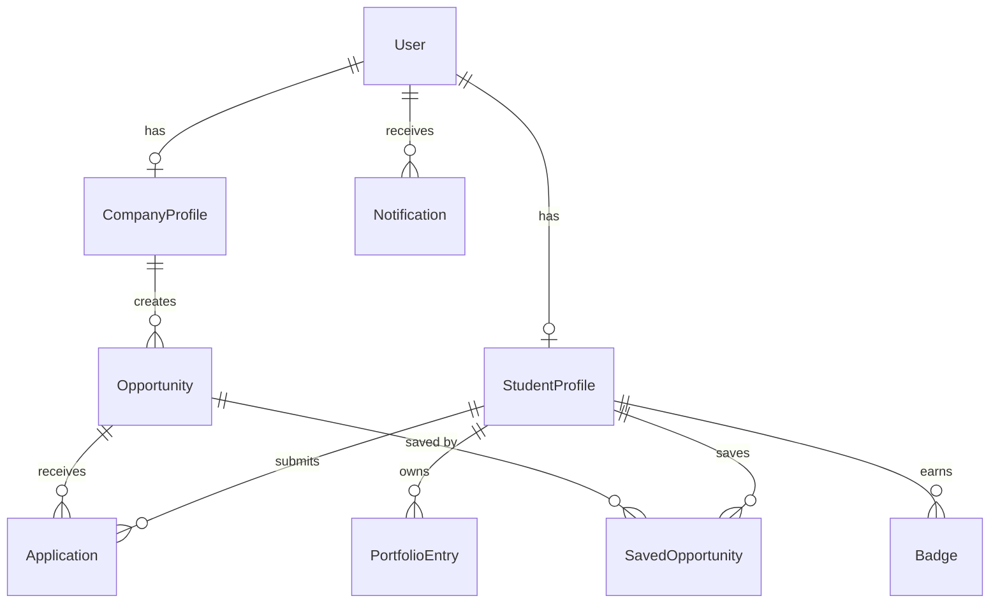

# Software Architecture Diagram
## WIRPL — Web Integration for Resources, Projects & Learning

---

| Atribut | Nilai |
|---------|-------|
| **Dokumen ID** | SAD-WIRPL-001 |
| **Versi** | 1.0.0 |
| **Tanggal** | 10 Juni 2026 |
| **Status** | Draft |
| **Standar** | ISO/IEC 12207 · ISO/IEC 25010 |

---

## Daftar Isi

1. [Tech Stack](#1-tech-stack)
2. [Arsitektur Sistem](#2-arsitektur-sistem)
3. [Struktur Direktori](#3-struktur-direktori)
4. [Request Lifecycle](#4-request-lifecycle)
5. [Database ERD & Model Data](#5-database-erd--model-data)
6. [Arsitektur Keamanan](#6-arsitektur-keamanan)
7. [Deployment Architecture](#7-deployment-architecture)

---

## 1. Tech Stack

| Layer | Teknologi | Versi | Alasan Dipilih |
|-------|-----------|-------|----------------|
| **Frontend Framework** | React | 18.x | Component-based, ecosystem besar, familiar tim |
| **Build Tool** | Vite | 5.x | Fast HMR, build cepat vs CRA |
| **Styling** | Tailwind CSS | 3.x | Utility-first, responsive by default, tidak perlu custom CSS banyak |
| **Form & Validation (FE)** | React Hook Form + Zod | latest | Terintegrasi, performan, type-safe validation |
| **HTTP Client** | Axios | 1.x | Interceptor untuk JWT auto-attach & refresh |
| **Routing** | React Router | 6.x | Nested routes, data loaders |
| **Notifications (UI)** | React Hot Toast | — | Ringan, mudah dipakai |
| **Icons** | Lucide React | — | Konsisten, tree-shakable |
| **Charts** | Recharts | 2.x | Declarative, React-native charts untuk admin analytics |
| **Backend Runtime** | Node.js | ≥ 18 LTS | Non-blocking I/O, ekosistem npm |
| **Backend Framework** | Express.js | 4.x | Minimal, fleksibel, familiar untuk tim student |
| **ORM** | Prisma | ≥ 5.x | Type-safe, migration mudah, developer experience baik |
| **Database** | PostgreSQL | ≥ 14 | Relational, robust, gratis di Railway |
| **Auth Mechanism** | JWT (HS256) | — | Stateless, scalable, access + refresh token pattern |
| **Password Hashing** | bcryptjs | — | Industri standar untuk password hashing |
| **Input Validation (BE)** | Zod | — | Schema validation yang konsisten antara FE & BE |
| **File Storage** | Cloudinary | SDK v2 | CDN terintegrasi, transformasi gambar otomatis |
| **Security Headers** | Helmet.js | — | HTTP security headers best practice |
| **Rate Limiting** | express-rate-limit | — | Proteksi DDoS dan brute force |
| **Frontend Deploy** | Vercel | — | Free tier, auto-deploy dari Git, edge CDN global |
| **Backend Deploy** | Railway | — | Free tier, PostgreSQL plugin, environment variables |

---

## 2. Arsitektur Sistem

```
┌─────────────────────────────────────────────────────────────────────────┐
│                            WIRPL SYSTEM                                 │
│                                                                         │
│   BROWSER / CLIENT                                                      │
│   ┌──────────────────────────────────────────────────────────────────┐  │
│   │  React 18 + Vite                                                 │  │
│   │  ┌────────────┐  ┌────────────┐  ┌────────────┐  ┌───────────┐  │  │
│   │  │  Pages     │  │ Components │  │  Contexts  │  │    Lib    │  │  │
│   │  │ /student   │  │  layout/   │  │AuthContext │  │  api.js   │  │  │
│   │  │ /company   │  │  ui/       │  │            │  │constants  │  │  │
│   │  │ /admin     │  │  opportunity│  │            │  │           │  │  │
│   │  │ /public    │  │            │  │            │  │           │  │  │
│   │  └─────┬──────┘  └──────┬─────┘  └────────────┘  └─────┬─────┘  │  │
│   │        └────────────────┴────────────────────────────────┘        │  │
│   │                              │                                     │  │
│   │                    Axios Instance                                  │  │
│   │                  (+ JWT Interceptor)                               │  │
│   └──────────────────────────┬───────────────────────────────────────┘  │
│                              │ HTTPS / REST API                          │
│                              ▼                                           │
│   BACKEND (Railway)                                                      │
│   ┌──────────────────────────────────────────────────────────────────┐  │
│   │  Node.js + Express.js                                            │  │
│   │                                                                  │  │
│   │  ┌─────────────────────────────────────────────────────────┐    │  │
│   │  │  MIDDLEWARE PIPELINE (per request)                      │    │  │
│   │  │  cors → helmet → globalLimiter → bodyParser             │    │  │
│   │  │  → authMiddleware → roleMiddleware → validate(Zod)      │    │  │
│   │  └──────────────────────────┬──────────────────────────────┘    │  │
│   │                             │                                    │  │
│   │  ┌──────────────────────────▼──────────────────────────────┐    │  │
│   │  │  ROUTES                                                 │    │  │
│   │  │  /api/auth         /api/opportunities  /api/applications│    │  │
│   │  │  /api/portfolio    /api/saved          /api/notifications│   │  │
│   │  │  /api/candidates   /api/admin          /api/users       │    │  │
│   │  └──────────────────────────┬──────────────────────────────┘    │  │
│   │                             │                                    │  │
│   │  ┌──────────────────────────▼──────────────────────────────┐    │  │
│   │  │  CONTROLLERS  (thin layer — hanya handle req/res)       │    │  │
│   │  └──────────────────────────┬──────────────────────────────┘    │  │
│   │                             │                                    │  │
│   │  ┌──────────────────────────▼──────────────────────────────┐    │  │
│   │  │  SERVICES  (business logic, badge triggers, notifs)     │    │  │
│   │  │  auth.service  │  opportunity.service  │  application   │    │  │
│   │  │  portfolio.service  │  notification.service  │  admin   │    │  │
│   │  └──────────────────────────┬──────────────────────────────┘    │  │
│   │                             │                                    │  │
│   │  ┌──────────────────────────▼──────────────────────────────┐    │  │
│   │  │  PRISMA ORM  (type-safe, prepared statements)           │    │  │
│   │  └──────────────────────────┬──────────────────────────────┘    │  │
│   └─────────────────────────────┼────────────────────────────────────┘  │
│                                 │                                         │
│   DATABASE (Railway Plugin)     │                                         │
│   ┌─────────────────────────────▼──────────────────────────┐             │
│   │  PostgreSQL ≥ 14                                        │             │
│   │  Tables: users, student_profiles, company_profiles,    │             │
│   │          opportunities, applications, saved_opportunities│            │
│   │          portfolio_entries, notifications, badges       │             │
│   └────────────────────────────────────────────────────────┘             │
│                                                                           │
│   EXTERNAL SERVICES                                                       │
│   ┌───────────────┐   ┌──────────────────┐   ┌────────────────────────┐  │
│   │  Cloudinary   │   │  JWT (Stateless) │   │  Email (future: v2.0)  │  │
│   │  (File CDN)   │   │  Access Token:   │   │  Nodemailer / Resend   │  │
│   │  - Avatar     │   │   exp 15m        │   │  (lupa password, notif │  │
│   │  - CV Upload  │   │  Refresh Token:  │   │   email)               │  │
│   │  - Dokumen    │   │   exp 7d         │   │                        │  │
│   └───────────────┘   └──────────────────┘   └────────────────────────┘  │
└───────────────────────────────────────────────────────────────────────────┘
```

---

## 3. Struktur Direktori

```
wirpl/
│
├── client/                          # Frontend Application
│   ├── public/
│   │   └── favicon.ico
│   ├── src/
│   │   ├── assets/                  # Gambar, ilustrasi static
│   │   ├── components/
│   │   │   ├── layout/
│   │   │   │   ├── AppLayout.jsx    # Sidebar + Outlet wrapper
│   │   │   │   ├── Navbar.jsx
│   │   │   │   ├── Sidebar.jsx
│   │   │   │   └── RouteGuards.jsx  # ProtectedRoute, RoleRoute
│   │   │   ├── ui/
│   │   │   │   ├── Badge.jsx
│   │   │   │   ├── Card.jsx
│   │   │   │   ├── Modal.jsx
│   │   │   │   └── SkeletonLoader.jsx
│   │   │   └── opportunity/
│   │   │       ├── OpportunityCard.jsx
│   │   │       └── OpportunityFilter.jsx
│   │   ├── contexts/
│   │   │   └── AuthContext.jsx      # JWT state, login, logout, user
│   │   ├── lib/
│   │   │   ├── api.js               # Axios instance + interceptors
│   │   │   └── constants.js         # Enums, maps, helper functions
│   │   ├── pages/
│   │   │   ├── public/
│   │   │   │   ├── LandingPage.jsx
│   │   │   │   ├── OpportunityDetailPage.jsx
│   │   │   │   └── PublicProfilePage.jsx
│   │   │   ├── auth/
│   │   │   │   ├── LoginPage.jsx
│   │   │   │   ├── RegisterPage.jsx
│   │   │   │   └── ForgotPasswordPage.jsx
│   │   │   ├── student/
│   │   │   │   ├── DashboardPage.jsx
│   │   │   │   ├── OpportunitiesPage.jsx
│   │   │   │   ├── ApplicationsPage.jsx
│   │   │   │   ├── SavedPage.jsx
│   │   │   │   ├── PortfolioPage.jsx
│   │   │   │   ├── NotificationsPage.jsx
│   │   │   │   ├── OnboardingPage.jsx
│   │   │   │   └── ProfileSettingsPage.jsx
│   │   │   ├── company/
│   │   │   │   ├── CompanyDashboard.jsx
│   │   │   │   ├── PostOpportunityPage.jsx
│   │   │   │   ├── ManageListingsPage.jsx
│   │   │   │   ├── ApplicantsPage.jsx
│   │   │   │   ├── CandidateSearchPage.jsx
│   │   │   │   └── CompanyProfilePage.jsx
│   │   │   └── admin/
│   │   │       ├── AdminDashboard.jsx
│   │   │       ├── ModerationPage.jsx
│   │   │       └── UserManagementPage.jsx
│   │   ├── App.jsx                  # Root router & route definitions
│   │   └── main.jsx                 # Entry point, render App
│   ├── index.html
│   ├── tailwind.config.js
│   ├── vite.config.js
│   └── package.json
│
└── server/                          # Backend Application
    ├── prisma/
    │   ├── schema.prisma            # Database schema definition
    │   ├── migrations/              # Migration history (auto-generated)
    │   └── seed.js                  # Development seed data
    ├── src/
    │   ├── controllers/             # Request handlers (thin layer)
    │   │   ├── auth.controller.js
    │   │   ├── opportunity.controller.js
    │   │   ├── application.controller.js
    │   │   ├── portfolio.controller.js
    │   │   ├── user.controller.js
    │   │   ├── notification.controller.js
    │   │   ├── admin.controller.js
    │   │   └── utils.controller.js
    │   ├── services/                # Business logic layer (fat layer)
    │   │   ├── auth.service.js
    │   │   ├── opportunity.service.js
    │   │   ├── application.service.js
    │   │   ├── portfolio.service.js
    │   │   ├── user.service.js
    │   │   ├── notification.service.js
    │   │   ├── admin.service.js
    │   │   └── recommendation.service.js
    │   ├── routes/                  # Express routers
    │   │   ├── auth.routes.js
    │   │   ├── opportunity.routes.js
    │   │   ├── application.routes.js
    │   │   ├── portfolio.routes.js
    │   │   ├── user.routes.js
    │   │   ├── notification.routes.js
    │   │   ├── admin.routes.js
    │   │   ├── candidate.routes.js
    │   │   └── utils.routes.js
    │   ├── middlewares/             # Express middlewares
    │   │   ├── auth.middleware.js   # JWT verification
    │   │   ├── role.middleware.js   # Role-based access control
    │   │   ├── validate.middleware.js # Zod schema validation
    │   │   ├── rateLimiter.middleware.js
    │   │   └── error.middleware.js  # Global error handler
    │   ├── validators/              # Zod schemas
    │   │   ├── auth.validator.js
    │   │   ├── opportunity.validator.js
    │   │   └── portfolio.validator.js
    │   ├── utils/
    │   │   └── prisma.js            # Singleton Prisma client
    │   ├── app.js                   # Express app configuration
    │   └── server.js                # HTTP server entry point
    ├── .env.example                 # Environment variables template
    └── package.json
```

---

## 4. Request Lifecycle

```
CLIENT (Browser)
     │
     │  1. Axios request
     │  2. Interceptor: attach "Authorization: Bearer <accessToken>"
     │
     ▼
RAILWAY (Backend)
     │
     │  3. CORS validation
     │  4. helmet() — set security headers
     │  5. globalLimiter — rate limit check
     │  6. express.json() — parse body
     │
     ▼
ROUTE HANDLER
     │
     │  7. authMiddleware — verify JWT
     │     - Invalid/expired → 401 Unauthorized
     │
     │  8. roleMiddleware(role) — check role
     │     - Role mismatch → 403 Forbidden
     │
     │  9. validate(ZodSchema) — validate request body
     │     - Schema fail → 400 Bad Request + error details
     │
     ▼
CONTROLLER
     │
     │  10. Call service function
     │      Pass req.user, req.body, req.params
     │
     ▼
SERVICE LAYER
     │
     │  11. Business logic execution
     │  12. Badge trigger check (if applicable)
     │  13. createNotification() call (if applicable)
     │
     ▼
PRISMA ORM
     │
     │  14. Prepared statement → PostgreSQL
     │  15. Transaction (for multi-step operations)
     │
     ▼
DATABASE RESPONSE
     │
     │  16. Data returned to service
     │  17. Service returns to controller
     │
     ▼
CONTROLLER RESPONSE
     │
     │  18. res.status(xxx).json(data)
     │
     ▼
CLIENT RECEIVES RESPONSE
     │
     │  - Success: update UI state
     │  - 401: Axios interceptor → try refreshToken
     │         If refresh fails → logout() + redirect /login
     │  - Error: show toast notification
```

---

## 5. Database ERD & Model Data



### Model Ringkasan

| Model | Primary Key | Field Kunci | Relasi |
|-------|-------------|-------------|--------|
| `User` | uuid | email (unique), passwordHash, role, isActive | → StudentProfile, CompanyProfile, Notification |
| `StudentProfile` | uuid | userId (FK), name, university, skills[], interests[], onboardingComplete | → Application, SavedOpportunity, PortfolioEntry, Badge |
| `CompanyProfile` | uuid | userId (FK), companyName, logoUrl, website | → Opportunity |
| `Opportunity` | uuid | companyId (FK), title, category, status, deadline, skillsRequired[] | → Application, SavedOpportunity |
| `Application` | uuid | studentId (FK), opportunityId (FK), status | Unique: [studentId, opportunityId] |
| `SavedOpportunity` | [studentId, opportunityId] | savedAt | Composite PK |
| `PortfolioEntry` | uuid | studentId (FK), type, title, skills[] | — |
| `Notification` | uuid | userId (FK), type, title, isRead, relatedId | — |
| `Badge` | uuid | studentId (FK), badgeType | Unique: [studentId, badgeType] |

### Enumerasi

| Enum | Nilai |
|------|-------|
| `Role` | `MAHASISWA` · `INDUSTRI` · `ADMIN` |
| `OpportunityCategory` | `INTERNSHIP` · `COLLABORATION` · `COMPETITION` · `TRAINING` |
| `OpportunityStatus` | `PENDING` · `ACTIVE` · `CLOSED` · `REJECTED` |
| `LocationType` | `REMOTE` · `ONSITE` · `HYBRID` |
| `ApplicationStatus` | `APPLIED` · `VIEWED` · `ACCEPTED` · `REJECTED` |
| `PortfolioType` | `INTERNSHIP` · `PROJECT` · `COMPETITION` · `CERTIFICATION` · `TRAINING` |

---

## 6. Arsitektur Keamanan

```
LAYER 1 — TRANSPORT SECURITY
  ✅ HTTPS enforced di production (Vercel + Railway)
  ✅ HSTS header via Helmet.js

LAYER 2 — API SECURITY
  ✅ JWT (HS256) — access token 15m, refresh token 7d
  ✅ Rate limiting: authLimiter (10/min) + globalLimiter (100/min)
  ✅ CORS whitelist: CLIENT_URL + *.vercel.app
  ✅ Helmet security headers (X-Frame-Options, CSP, etc.)

LAYER 3 — INPUT SECURITY
  ✅ Zod schema validation pada SEMUA endpoint
  ✅ Sanitization: no raw string concatenation ke query
  ✅ Prisma ORM: prepared statements (SQL Injection prevention)

LAYER 4 — AUTH & AUTHZ
  ✅ bcryptjs hashing (rounds: 12) untuk semua password
  ✅ authMiddleware: JWT verification pada setiap protected route
  ✅ roleMiddleware: role-based access control
  ✅ Ownership check pada service layer (e.g., hanya pemilik bisa edit)

LAYER 5 — DATA PRIVACY
  ✅ Password hash tidak pernah diekspos dalam response API
  ✅ Email/PII Mahasiswa tidak diekspos ke endpoint INDUSTRI (/candidates)
  ✅ Semua secret dari environment variables (.env), tidak hardcoded

LAYER 6 — CREDENTIAL MANAGEMENT
  ✅ .env.example sebagai template, .env di .gitignore
  ✅ DATABASE_URL, JWT_SECRET, CLOUDINARY_* hanya dari env
```

---

## 7. Deployment Architecture

```
DEVELOPMENT                    STAGING / PRODUCTION
──────────────                 ────────────────────────────────────
localhost:5173 (Vite)          Vercel Edge Network (CDN)
localhost:5000 (Express)       ┌──────────────────────────────────┐
localhost:5432 (PostgreSQL)    │  Frontend (Vercel)               │
                               │  - Auto-deploy from main branch  │
                               │  - Environment: VITE_API_URL     │
                               └─────────────────┬────────────────┘
                                                 │ HTTPS
                               ┌─────────────────▼────────────────┐
                               │  Backend (Railway)               │
                               │  - Auto-deploy from main branch  │
                               │  - npx prisma migrate deploy     │
                               │    (auto on start)               │
                               │  - Environment: DATABASE_URL,    │
                               │    JWT_SECRET, CLOUDINARY_*      │
                               └─────────────────┬────────────────┘
                                                 │ Internal Network
                               ┌─────────────────▼────────────────┐
                               │  PostgreSQL (Railway Plugin)     │
                               │  - Managed, auto-backup          │
                               │  - Connection via DATABASE_URL   │
                               └──────────────────────────────────┘
```

**Environment Variables yang Diperlukan:**

| Variable | Digunakan di | Keterangan |
|----------|-------------|------------|
| `DATABASE_URL` | Backend | PostgreSQL connection string |
| `JWT_SECRET` | Backend | Secret key untuk signing JWT |
| `JWT_REFRESH_SECRET` | Backend | Secret key untuk refresh token |
| `CLOUDINARY_CLOUD_NAME` | Backend | Cloudinary identifier |
| `CLOUDINARY_API_KEY` | Backend | Cloudinary API key |
| `CLOUDINARY_API_SECRET` | Backend | Cloudinary API secret |
| `CLIENT_URL` | Backend | CORS allowed origin |
| `VITE_API_URL` | Frontend | Base URL backend API |

---

*Standar referensi: ISO/IEC 12207 · ISO/IEC 25010 · OWASP Top 10:2021*
*© 2026 Tim Pengembang WIRPL*
